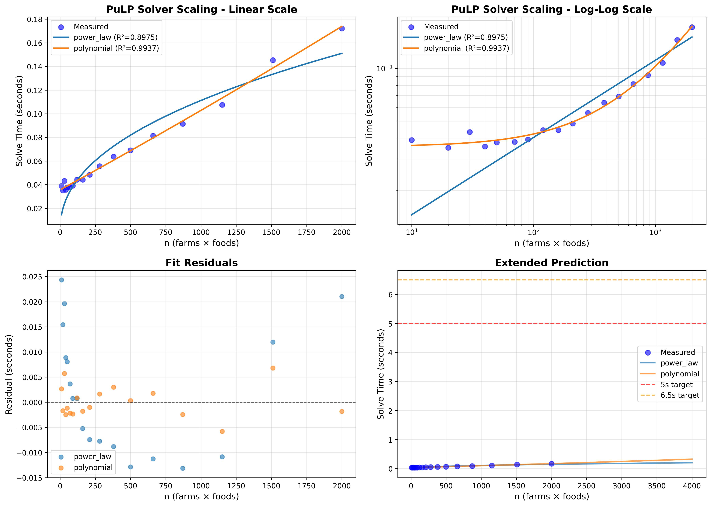

# PuLP Solver Scaling Analysis - Full Family Scenario

**Date**: 2025-10-21 19:52:02

## Experimental Setup

- **Scenario**: full_family
- **Farm counts tested**: 18 (1 to 200)
- **Number of foods**: ~10
- **Problem size (n)**: 10 to 2000

## Measured Data

| Farms | Foods | n | Variables | Constraints | Solve Time (s) | Status |
|-------|-------|---|-----------|-------------|----------------|--------|
| 1 | 10 | 10 | 20 | 31 | 0.039 | Infeasible |
| 2 | 10 | 20 | 40 | 62 | 0.035 | Infeasible |
| 3 | 10 | 30 | 60 | 93 | 0.043 | Optimal |
| 4 | 10 | 40 | 80 | 124 | 0.036 | Optimal |
| 5 | 10 | 50 | 100 | 155 | 0.038 | Optimal |
| 7 | 10 | 70 | 140 | 217 | 0.038 | Optimal |
| 9 | 10 | 90 | 180 | 279 | 0.039 | Optimal |
| 12 | 10 | 120 | 240 | 372 | 0.044 | Optimal |
| 16 | 10 | 160 | 320 | 496 | 0.044 | Optimal |
| 21 | 10 | 210 | 420 | 651 | 0.048 | Optimal |
| 28 | 10 | 280 | 560 | 868 | 0.056 | Optimal |
| 38 | 10 | 380 | 760 | 1178 | 0.064 | Optimal |
| 50 | 10 | 500 | 1000 | 1550 | 0.069 | Optimal |
| 66 | 10 | 660 | 1320 | 2046 | 0.081 | Optimal |
| 87 | 10 | 870 | 1740 | 2697 | 0.091 | Optimal |
| 115 | 10 | 1150 | 2300 | 3565 | 0.107 | Optimal |
| 151 | 10 | 1510 | 3020 | 4681 | 0.145 | Optimal |
| 200 | 10 | 2000 | 4000 | 6200 | 0.172 | Optimal |

## Fitted Models

### Power Law

- **Formula**: `y = 5.26e-03 * x^0.442`
- **R² score**: 0.897472

### Polynomial

- **Formula**: `y = 1.92e-09 * x^2 + 6.53e-05 * x + 3.56e-02`
- **R² score**: 0.993723

### Best Model: Polynomial

The polynomial model provides the best fit with R² = 0.993723

## Extrapolation Results

### Target Solve Time: 5.0 seconds

| Model | n | Estimated Farms | Predicted Time (s) |
|-------|---|-----------------|--------------------|
| power_law | 99999 | 9999.9 | 0.850 |
| polynomial | 36718 | 3671.8 | 5.028 |

### Target Solve Time: 6.5 seconds

| Model | n | Estimated Farms | Predicted Time (s) |
|-------|---|-----------------|--------------------|
| power_law | 99999 | 9999.9 | 0.850 |
| polynomial | 43359 | 4335.9 | 6.484 |

## Visualization

## Conclusions

Based on the polynomial model:

- To achieve a solve time of **5.0 seconds**, you need approximately:
  - **n = 36718** (farms × foods)
  - **~3671 farms** (assuming 10 foods)

- To achieve a solve time of **6.5 seconds**, you need approximately:
  - **n = 43359** (farms × foods)
  - **~4335 farms** (assuming 10 foods)

