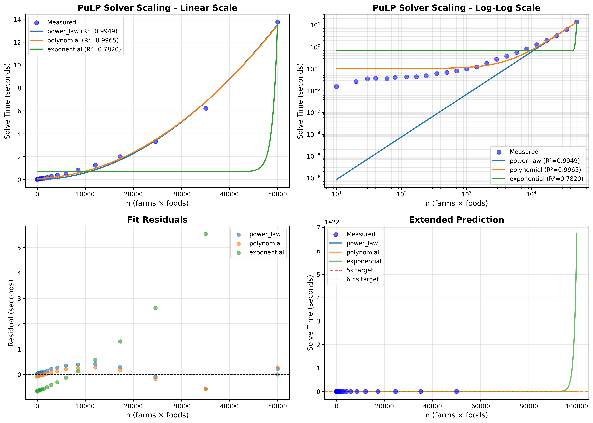

# PuLP Solver Scaling Analysis - Full Family Scenario

**Date**: 2025-10-21 19:54:51

## Experimental Setup

- **Scenario**: full_family
- **Farm counts tested**: 24 (1 to 5000)
- **Number of foods**: ~10
- **Problem size (n)**: 10 to 50000

## Measured Data

| Farms | Foods | n | Variables | Constraints | Solve Time (s) | Status |
|-------|-------|---|-----------|-------------|----------------|--------|
| 1 | 10 | 10 | 20 | 31 | 0.015 | Infeasible |
| 2 | 10 | 20 | 40 | 62 | 0.026 | Infeasible |
| 3 | 10 | 30 | 60 | 93 | 0.035 | Optimal |
| 4 | 10 | 40 | 80 | 124 | 0.037 | Optimal |
| 6 | 10 | 60 | 120 | 186 | 0.035 | Optimal |
| 8 | 10 | 80 | 160 | 248 | 0.041 | Optimal |
| 12 | 10 | 120 | 240 | 372 | 0.043 | Optimal |
| 17 | 10 | 170 | 340 | 527 | 0.043 | Optimal |
| 24 | 10 | 240 | 480 | 744 | 0.048 | Optimal |
| 35 | 10 | 350 | 700 | 1085 | 0.060 | Optimal |
| 50 | 10 | 500 | 1000 | 1550 | 0.068 | Optimal |
| 71 | 10 | 710 | 1420 | 2201 | 0.080 | Optimal |
| 101 | 10 | 1010 | 2020 | 3131 | 0.097 | Optimal |
| 144 | 10 | 1440 | 2880 | 4464 | 0.122 | Optimal |
| 205 | 10 | 2050 | 4100 | 6355 | 0.180 | Optimal |
| 292 | 10 | 2920 | 5840 | 9052 | 0.270 | Optimal |
| 417 | 10 | 4170 | 8340 | 12927 | 0.377 | Optimal |
| 595 | 10 | 5950 | 11900 | 18445 | 0.558 | Optimal |
| 848 | 10 | 8480 | 16960 | 26288 | 0.815 | Optimal |
| 1209 | 10 | 12090 | 24180 | 37479 | 1.259 | Optimal |
| 1724 | 10 | 17240 | 34480 | 53444 | 1.984 | Optimal |
| 2459 | 10 | 24590 | 49180 | 76229 | 3.305 | Optimal |
| 3506 | 10 | 35060 | 70120 | 108686 | 6.217 | Optimal |
| 5000 | 10 | 50000 | 100000 | 155000 | 13.753 | Optimal |

## Fitted Models

### Power Law

- **Formula**: `y = 9.64e-09 * x^1.947`
- **R² score**: 0.994857

### Polynomial

- **Formula**: `y = 5.13e-09 * x^2 + 1.09e-05 * x + 9.98e-02`
- **R² score**: 0.996545

### Exponential

- **Formula**: `y = 2.54e-21 * exp(1.00e-03 * x) + 6.83e-01`
- **R² score**: 0.782028

### Best Model: Polynomial

The polynomial model provides the best fit with R² = 0.996545

## Extrapolation Results

### Target Solve Time: 5.0 seconds

| Model | n | Estimated Farms | Predicted Time (s) |
|-------|---|-----------------|--------------------|
| power_law | 30077 | 3007.7 | 5.030 |
| polynomial | 29882 | 2988.2 | 5.009 |
| exponential | 48899 | 4889.9 | 5.030 |

### Target Solve Time: 6.5 seconds

| Model | n | Estimated Farms | Predicted Time (s) |
|-------|---|-----------------|--------------------|
| power_law | 34375 | 3437.5 | 6.524 |
| polynomial | 34375 | 3437.5 | 6.540 |
| exponential | 49193 | 4919.3 | 6.516 |

## Visualization

## Conclusions

Based on the polynomial model:

- To achieve a solve time of **5.0 seconds**, you need approximately:
  - **n = 29882** (farms × foods)
  - **~2988 farms** (assuming 10 foods)

- To achieve a solve time of **6.5 seconds**, you need approximately:
  - **n = 34375** (farms × foods)
  - **~3437 farms** (assuming 10 foods)

